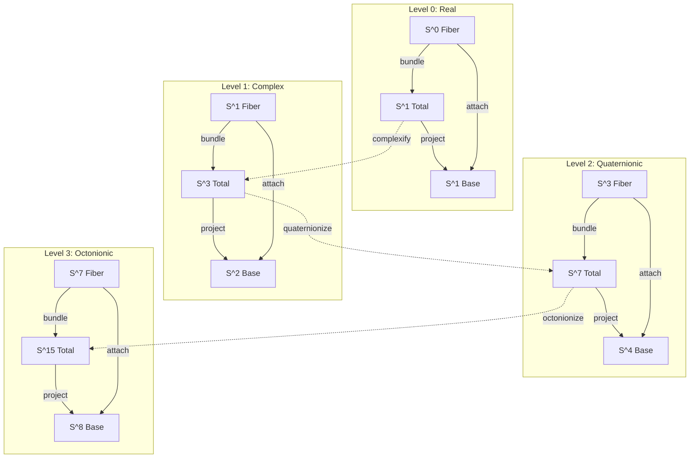

# Hopf Fibration Accounting Architecture: Division Algebra Implementation

## System Entity Definitions

### Entity: DivisionAlgebraLevel
```
Type: topological_fiber_bundle_level
Mathematical Basis: Normed division algebras (ℝ, ℂ, ℍ, 𝕆)
Cardinality: Exactly 4 levels (Hurwitz theorem constraint)

Attributes:
├── level_index: {0, 1, 2, 3} (finite enumeration)
├── division_algebra: {ℝ, ℂ, ℍ, 𝕆} (algebraic structure)
├── fiber_dimension: {1, 2, 4, 8} (2^level)
├── total_dimension: {1, 3, 7, 15} (2^(level+1) - 1)
└── base_dimension: {1, 2, 4, 8} (2^level)

Relationships:
├── DivisionAlgebraLevel → FiberSpace: 1:1 (unique fiber manifold)
├── DivisionAlgebraLevel → TotalSpace: 1:1 (unique total manifold)
├── DivisionAlgebraLevel → BaseSpace: 1:1 (unique base manifold)
└── DivisionAlgebraLevel → MorphismClass: 1:1 (complexity tier)
```

### Entity: Level0System (Real Bundle)
```
Type: trivial_circle_bundle
Fiber: S^0 = {-1, +1} (discrete two-point space)
Total: S^1 (circle)
Base: S^1 (circle)

Financial Semantics:
├── Fiber (S^0): Binary additive operations {debit, credit}
├── Total (S^1): Cyclic transaction flow
├── Base (S^1): Account data points on circle
└── Morphisms: Proportional transformations (linear scaling)

Relationships:
├── S^0 → AdditiveOperation: 1:2 (maps to +/-)
├── S^1_total → TransactionCycle: 1:N (periodic flows)
├── S^1_base → AccountDataPoint: 1:N (parameterized accounts)
└── ProportionalMorphism → LinearMap: 1:1 (ℝ-linear)
```

### Entity: Level1System (Complex Bundle)
```
Type: hopf_fibration_classical
Fiber: S^1 (unit circle in ℂ)
Total: S^3 (unit sphere in ℂ²)
Base: S^2 (Riemann sphere)

Financial Semantics:
├── Fiber (S^1): Product ring operations (cyclic group)
├── Total (S^3): Production space (input-output relations)
├── Base (S^2): Information surface (account categories)
└── Morphisms: Polynomial transformations (up to degree n)

Relationships:
├── S^1 → ProductRing: 1:1 (multiplicative structure)
├── S^3 → ProductionSpace: 1:1 (4D state space)
├── S^2 → InformationManifold: 1:1 (account topology)
└── PolynomialMorphism → ComplexPolynomial: 1:N (ℂ[z])
```

### Entity: Level2System (Quaternionic Bundle)
```
Type: quaternionic_hopf_fibration
Fiber: S^3 (unit quaternions)
Total: S^7 (unit octonions in ℍ²)
Base: S^4 (quaternionic projective line)

Financial Semantics:
├── Fiber (S^3): Power series operations (non-commutative)
├── Total (S^7): Creation space (generative processes)
├── Base (S^4): Knowledge manifold (structured insights)
└── Morphisms: Exponential transformations (e^{tX})

Relationships:
├── S^3 → PowerSeriesAlgebra: 1:1 (formal series)
├── S^7 → CreationSpace: 1:1 (8D generative field)
├── S^4 → KnowledgeStructure: 1:1 (5D information)
└── ExponentialMorphism → LieGroupAction: 1:N (non-abelian)
```

### Entity: Level3System (Octonionic Bundle)
```
Type: octonionic_hopf_fibration
Fiber: S^7 (unit octonions)
Total: S^15 (Cayley plane structure)
Base: S^8 (octonionic projective line)

Financial Semantics:
├── Fiber (S^7): Prime index operations (non-associative)
├── Total (S^15): Recursive space (self-referential systems)
├── Base (S^8): Wisdom manifold (meta-knowledge)
└── Morphisms: Ordinal transformations (transfinite)

Relationships:
├── S^7 → PrimeIndexAlgebra: 1:1 (factorization)
├── S^15 → RecursiveStructure: 1:1 (16D phase space)
├── S^8 → WisdomTopology: 1:1 (9D understanding)
└── OrdinalMorphism → TransfiniteOperation: 1:N (well-ordered)
```

## Relationship Type Matrix

### Inter-Level Relationships

| Source Level | Target Level | Relationship Type | Cardinality | Constraint |
|--------------|--------------|-------------------|-------------|------------|
| Level0 | Level1 | Complexification | 1:1 | ℝ ⊂ ℂ embedding |
| Level1 | Level2 | Quaternionization | 1:1 | ℂ ⊂ ℍ embedding |
| Level2 | Level3 | Octonionization | 1:1 | ℍ ⊂ 𝕆 embedding |
| Level_n | Level_{n+1} | Cayley-Dickson | 1:1 | Dimension doubling |

### Intra-Level Entity Relations



## Boundary Constraints

### Algebraic Boundaries

```
Division Algebra Constraints:
├── Level 0 (ℝ): Commutative, associative, ordered
├── Level 1 (ℂ): Commutative, associative, not ordered
├── Level 2 (ℍ): Non-commutative, associative, not ordered
└── Level 3 (𝕆): Non-commutative, non-associative, not ordered

Operational Boundaries:
├── ℝ operations: Full field properties
├── ℂ operations: Field minus ordering
├── ℍ operations: Skew field (division ring)
└── 𝕆 operations: Alternative algebra only
```

### Topological Boundaries

| Level | Fiber Bundle | Homotopy Groups | Characteristic Classes |
|-------|--------------|-----------------|----------------------|
| 0 | S^0 → S^1 → S^1 | π₁(S^1) = ℤ | Trivial |
| 1 | S^1 → S^3 → S^2 | π₃(S^2) = ℤ | c₁ ≠ 0 |
| 2 | S^3 → S^7 → S^4 | π₇(S^4) = ℤ ⊕ ℤ/12 | p₁ ≠ 0 |
| 3 | S^7 → S^15 → S^8 | π₁₅(S^8) = ℤ ⊕ ℤ/120 | Complex |

### Computational Boundaries

```
GGML Tensor Constraints:
├── Level 0: 2D tensors (real matrices)
├── Level 1: 4D tensors (complex operations)
├── Level 2: 8D tensors (quaternion algebra)
└── Level 3: 16D tensors (octonion operations)

Memory Scaling:
├── Level 0: O(n) for n accounts
├── Level 1: O(n²) for interactions
├── Level 2: O(n⁴) for quaternionic state
└── Level 3: O(n⁸) for octonionic space
```

## Permission and Access Hierarchies

### Level-Based Access Control

```
Access Permission Structure:
├── Level 0 Access (Basic)
│   ├── Read: Account balances
│   ├── Write: Simple transactions
│   ├── Execute: Proportional morphisms
│   └── Audit: Linear traces
├── Level 1 Access (Intermediate)
│   ├── Read: Information topology
│   ├── Write: Production operations
│   ├── Execute: Polynomial morphisms
│   └── Audit: Complex analysis
├── Level 2 Access (Advanced)
│   ├── Read: Knowledge structures
│   ├── Write: Creation processes
│   ├── Execute: Exponential morphisms
│   └── Audit: Non-commutative traces
└── Level 3 Access (Meta)
    ├── Read: Wisdom patterns
    ├── Write: Recursive definitions
    ├── Execute: Ordinal morphisms
    └── Audit: Non-associative logic
```

### Entity Access Matrix

| Entity Type | Level 0 | Level 1 | Level 2 | Level 3 |
|-------------|---------|---------|---------|---------|
| AccountData | RW | R | R | R |
| TransactionFlow | RW | RW | R | R |
| ProductionSpace | - | RW | RW | R |
| KnowledgeBase | - | - | RW | RW |
| RecursiveLogic | - | - | - | RW |

### Role-Based Permissions

```
Role Hierarchy:
├── DataOperator
│   ├── Level: 0 only
│   ├── Operations: Additive sums
│   └── Morphisms: Proportional
├── InformationAnalyst
│   ├── Levels: 0-1
│   ├── Operations: Product rings
│   └── Morphisms: Polynomial
├── KnowledgeEngineer
│   ├── Levels: 0-2
│   ├── Operations: Power series
│   └── Morphisms: Exponential
└── WisdomArchitect
    ├── Levels: 0-3
    ├── Operations: Prime indices
    └── Morphisms: Ordinal
```

## Implementation Architecture

### GGML Tensor Encoding

```cpp
// Level-specific tensor structures
struct AccountTensor {
    ggml_tensor* level0_data;      // [n_accounts, 2] (real)
    ggml_tensor* level1_info;      // [n_accounts, 4] (complex)
    ggml_tensor* level2_knowledge; // [n_accounts, 8] (quaternion)
    ggml_tensor* level3_wisdom;    // [n_accounts, 16] (octonion)
};

// Morphism implementations by level
struct MorphismTensor {
    ggml_tensor* proportional;  // [2, 2] real matrix
    ggml_tensor* polynomial;    // [4, 4] complex coefficients
    ggml_tensor* exponential;   // [8, 8] quaternion generator
    ggml_tensor* ordinal;       // [16, 16] octonion structure
};
```

### Fiber Bundle Operations

```cpp
// Hopf projection for each level
ggml_tensor* hopf_project_level(
    ggml_context* ctx,
    ggml_tensor* total_point,
    int level
) {
    switch(level) {
        case 0: return project_s1_to_s1(ctx, total_point);
        case 1: return project_s3_to_s2(ctx, total_point);
        case 2: return project_s7_to_s4(ctx, total_point);
        case 3: return project_s15_to_s8(ctx, total_point);
    }
}
```

## System Interdependencies

### Vertical Dependencies (Inter-Level)
```
Dependency Chain:
Level3 ←depends← Level2 ←depends← Level1 ←depends← Level0
  ↓                ↓                ↓                ↓
Wisdom         Knowledge      Information         Data
  ↓                ↓                ↓                ↓
Ordinal       Exponential     Polynomial    Proportional
```

### Horizontal Dependencies (Intra-Level)
```
Within Each Level:
Fiber ←→ Total ←→ Base
  ↓        ↓        ↓
Operations Logic Accounts
```

This architecture leverages the unique mathematical properties of the four normed division algebras to create a natural 4-level hierarchy.
Each level provides increasing computational power while maintaining strict mathematical constraints, with the non-existence of additional division algebras providing a natural termination at Level 3.
